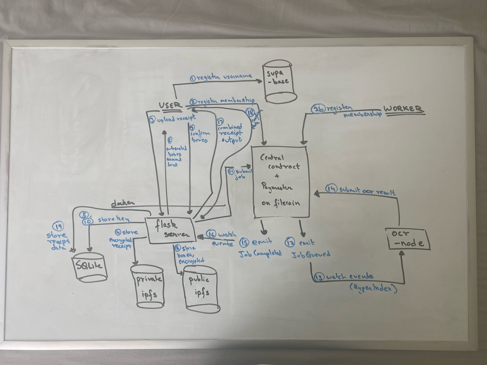

# Privacy Preserving OCR Network

The following document outlines the deployed protocol on Filecoin that is privacy preserving and 
the rationales behind choices made. There are two types of parties in this network, the (regular)
user and ocr-worker.

### Why does this exist?

The goal of the project is to perform OCR on uploaded receipts, but since the user is expected 
to upload eery receipt, this can become a dangerous profiling tool. As such, a priacy preserving 
network is needed, where no one entity knows everything about a user, and ideally does not even 
know the user.

### Basic Overview

The key pieces in this protocol feature local ipfs nodes, onchain zk identity and rate limited 
job submissions, encrypted results, data dao and data aggregation.

At a high level, the following actions enable the network,
- Upon signing up, 
  - Users register their membership on the central contract
  - Users also have an option to register as a ocr-worker node
  - Users deploy a docker container (locally or cloud) with scripts and local ipfs nodes
- For every "uploaded" receipt,
  - Users draw boxes around relevant text (assisted by scripts)
  - The boxes are encrypted and added to local ipfs node
  - CID submitted to central contract as job
- For every job submitted to the central contract,
  - Contract validates membership and rate limits
  - Contract adds job to queue and emits event
  - ocr-worker pulls job via user's ipfs node
  - ocr-worker performs ocr and submits results to central contract
  - Contract validates membership and emits event
  - User's node pulls results from contract and confirms with user
- Finally, both users and workers are subject to reputation system, and potential challenges (the 
network is generally optimistic in nature)
  - Workers are rated by users on speed, acuracy, adherence to public ocr module behavior, etc.
  - Workers may be challenged on their outputs when obviously faulty (eg, garbled text)
  - Users may be challenged on their job requests if metadata submission is inconsistent with ipfs 
  content

You can also see the diagram below for the basic data flow,

<!-- 
## Basic flow
1. user creates boxes somehow (either automated and then confirmed, or actual drawings)
2. these boxes are converted to standard shapes, later step (show with dotted box)
3. encrypts with own private key, and sends encryption, public key, some metadata about shape or number of boxes, size of download, etc. to central contract (likely filecoin, using fevm, do u know about nuances of fevm?)
4. contract emits job-added event
5. some node is watching for events and is thus notified of new job
6. node pulls, decrypts image using provided public key, performs ocr
7. node then encrypts ocr result with provided public key, and sends to central contract along with job_id
8. contract emits job-completed event
9. user pulls data back from contract by providing their secret and nullifer.. okay, this part not sure yet.. how exactly did tornado work? how does the zk come in? im guessing zk here so secret is not actually revealed.. but not sure of zk algos, might just fork tornado or something..

10. after all jobs are completed associated with the receipt, user recombines outputs and gets final ocr-ed output.. 
11. user confirms and stores on local machine, along with original full image.. this pair will be used later to train onchain model.. but again, different process, much later..
-->

Finally, see below for more in depth information about each mechanism of the protocol.

## Off Chain Containers
> local or deployed to the cloud

### IPFS Nodes

## On Chain Mechanisms

### Anonymous membership

### Rate Limits

### Disputes

### Aggregation

### DataDAO

## Monetisation

### Rate Limits

### Federated Learning